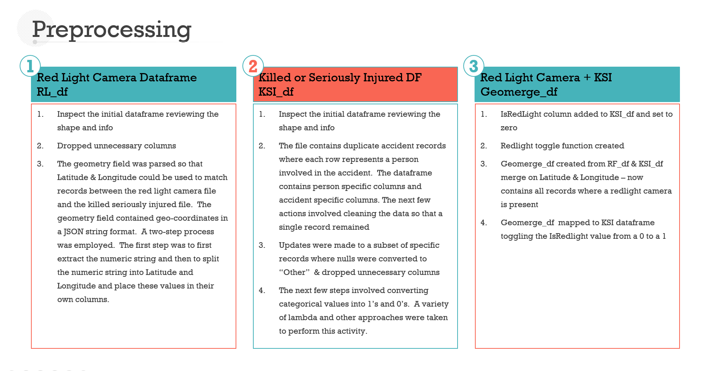
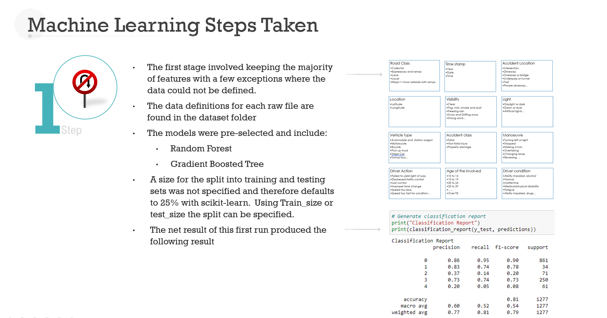
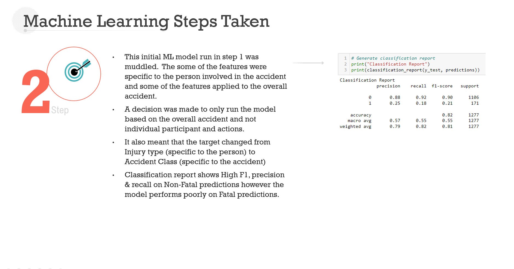
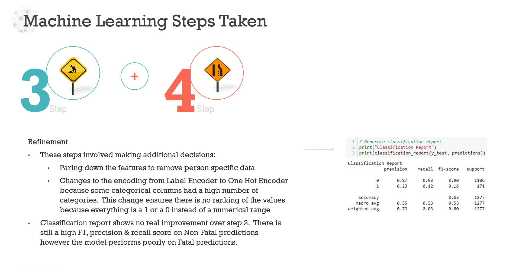
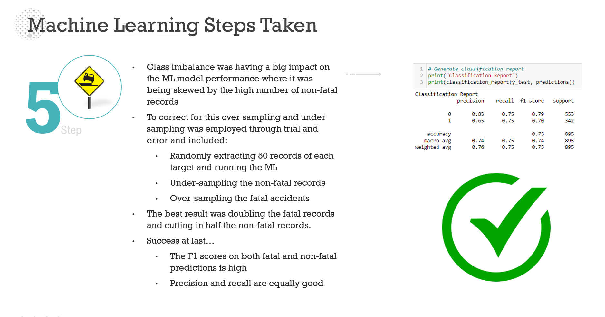

# Machine Learning
In our machine leaning approach, we will be using classification models, random forest and gradient boosting.

## Random Forest
As we know where the cameras are already installed, we will use the factors of the accidents at those locations to train our model to predict the location of red-light cameras based on the factors of traffic accidents. As there are many factors that affects a collision in an intersection, using a random forest enables feature randomness when building individual trees, to which the forest will make a more accurate prediction by committee. 

## Gradient Boosting
As major and more severe collisions occur infrequently compared to the whole scope of collisions, the model we build may hold some form of bias and skewness. In other words, the random forest may produce predictions solely on the factors that affect minor collisions. This would mean the false negatives could be locations where major accidents had occurred, and the camera could be impacting such collisions. Thus, we will also test and employ gradient boosting. Gradient boosting will weight the observations and put more weight on the major collisions and less on minor collisions as they will already be handled well during training. This should reduce the bias and skewness of the model. 

## Preprocessing

## ML Iterations & Results

