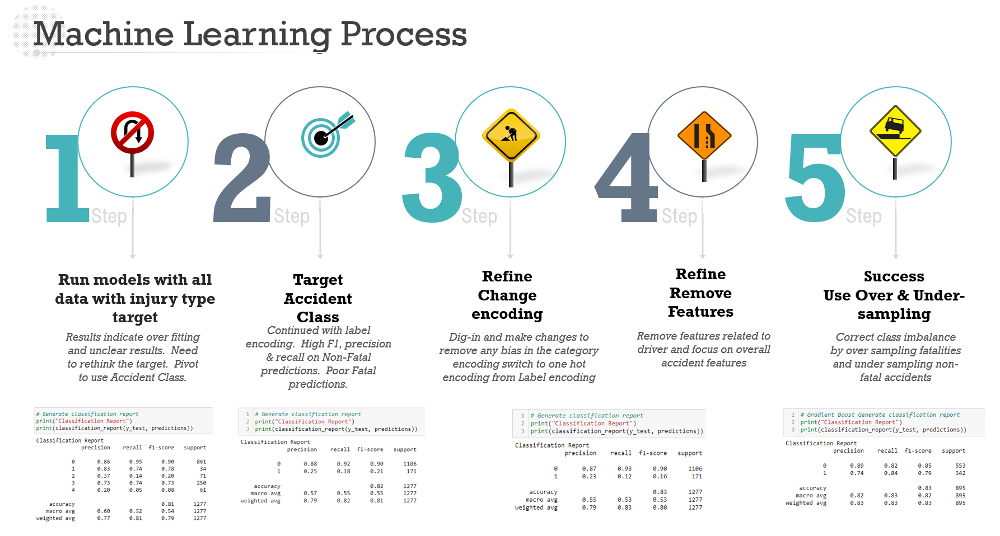

# Crash Detectives

## Overview
The purpose of this project is to explore an overall analysis of the City of Toronto serious injury or fatal accident data and the impact of red light cameras on reducing severity.

## Research Topic 

### Goal & Questions to be answered
The goal of this analysis is to provide the Toronto Police, City Planners, and general public insights on the effectivnes and impact of the redlight camera program on crash severity.

The null hypothesis is that redlight cameras on have no impact on crash severity.  The alternate hypothesis is redlight cameras reduce accident serverity.

Leveraging the Toronto Police traffic collision data and serious injury data sets additional areas of inquiry includes researching what additional features are correleated with severe accidents such as roadway types, light conditions, wet or dry roads, and time of day.

### Data Source Description

The dataset is used for this analysis is from the City of Toronto's Open Data Portal.  

The traffic colision file provides a history of all accidents in the City of Toronto which includes the geocoorindates for the nearest intersection, data and time of the collision, policde division, neighbourhood as well as if there were any fatalities.  The seriously injured or killed file is a rich data source describing the physical characteristics at the scene of the accident such as road type, road surface conditions, details regarding all people involved in the accident including age, etc...  The Red light file provides the date of activation for when red light cameras were installed and the location.  All three files provide geo location coordinates.

- Seriously injured/killed collisions data : [Dataset 1](https://open.toronto.ca/dataset/motor-vehicle-collisions-involving-killed-or-seriously-injured-persons/)
- Red light cameras data : [Dataset 2](https://open.toronto.ca/dataset/red-light-cameras/)
- Traffic collision data : [Dataset 3](https://open.toronto.ca/dataset/police-annual-statistical-report-traffic-collisions/) 

## Machine Learning
In our machine leaning approach, we will be using classification models, random forest and gradient boosting, details can be found [here](https://github.com/barharding/Crash-Detectives/blob/main/ML%20Notebooks/README.md)

### Initial ML Dashboard

### Database

We will be storing our data in SQL Server.
We are planning to create the relation in between the table based on their Geo location beacuse all the tables have geometry column in common.
   
### Dashboard

The storyboard is shown as a preview in the presentation.  
The dashboard is located [here](https://public.tableau.com/app/profile/richelle.qin/viz/CrashDetective-TorontoViz/Summary)

## Project Team Members
- Aditi
- Bardhonia
- Kritika
- Richelle
